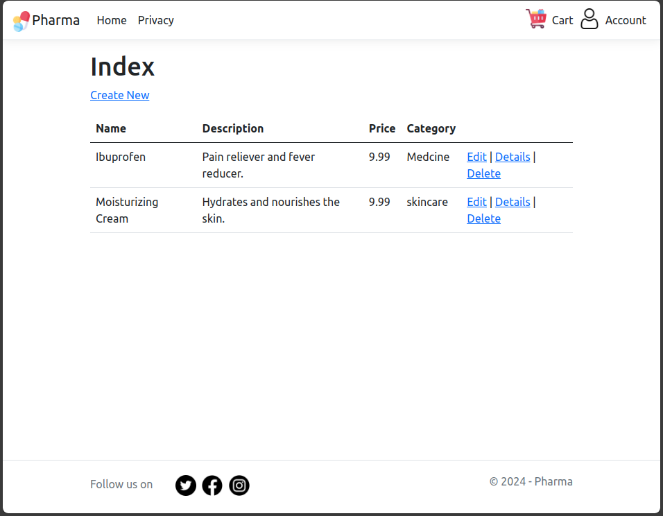
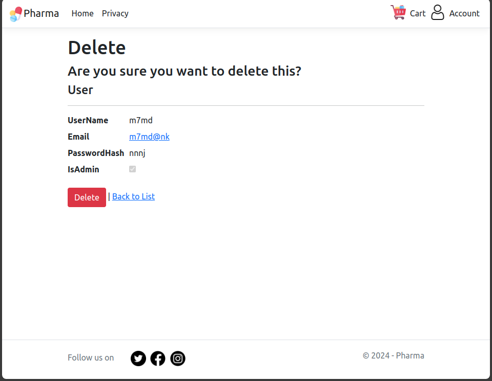

# Exploring .NET MVC8 Framework for a Pharmacy Web Application

## 1. Introduction

This document outlines the steps to explore and implement the .NET MVC8 framework for developing a pharmacy web application. The objective is to gain hands-on experience with the .NET MVC framework and create a functional web application that manages categories, products, orders, and users.

## 2. Getting Started

### 2.1. Prerequisites

.NET SDK and Visual Studio Code (VSCode) for development.

### 2.2. Setting Up the Environment

create a new .NET MVC project using the following command:

```bash
    dotnet new mvc -o project-name
```

## 3. Adding Data Model Classes

The application consists of several models representing different entities:

- User Model.
- Product Model.
- Category Model.
- OrderItem Model.
- Order Model.

## 4. Adding NuGet Packages

Add the necessary NuGet packages for Entity Framework Core and other dependencies.

``` bash
    dotnet add package Microsoft.EntityFrameworkCore
    dotnet add package Microsoft.EntityFrameworkCore.SqlServer
    dotnet add package Microsoft.EntityFrameworkCore.Tools
    dotnet add package Microsoft.AspNetCore.Identity.EntityFrameworkCore
```

## 5. Generating Controllers, Views, and Data Context

Use the .NET CLI to generate controllers, views, and data context.

```bash
    dotnet aspnet-codegenerator controller -name ProductController -m Product -dc ApplicationDbContext --relativeFolderPath Controllers --useDefaultLayout --referenceScriptLibraries
```

## 6. Creating the Database with EF Core Migrations

Run the following commands to create the database:

```bash
    dotnet ef migrations add InitialCreate
    dotnet ef database update
```

## 7. Frontend Development

To serve the purpose of initial understanding, a simple frontend has been created, including a navbar, footer, and home index screen.


### Some snippts of view pages handelling Database






### TODO

1. Authentication and Authorization
2. Better UI/UX.
3. Real orders and users Management.
4. Testing and Deployment.
